# BEDMS Database ER Diagram

Backend cua ban dang dung MongoDB + Mongoose, nen day la so do cac `collection` theo schema thuc te trong `BEDMS/src/models`.

```mermaid
erDiagram
    USERS {
        ObjectId _id
        string email
        string password_hash
        string google_id
        string fullname
        string role
        boolean is_active
        date last_login
        date createdAt
        date updatedAt
    }

    STUDENTS {
        ObjectId _id
        ObjectId user
        string student_code
        string full_name
        date date_of_birth
        string gender
        string phone
        string citizen_id
        string permanent_address
        string avatar_url
        string major
        string cohort
        string student_type
        number behavioral_score
        number violations_current_semester
        boolean is_banned_permanently
        string ban_until_semester
        date createdAt
        date updatedAt
    }

    STAFFS {
        ObjectId _id
        ObjectId user
        string staff_code
        string full_name
        date date_of_birth
        string gender
        string phone
        string position
        date createdAt
        date updatedAt
    }

    DORMS {
        ObjectId _id
        string dorm_name
        string dorm_code
        number total_floors
        number total_blocks
        string description
        boolean is_active
        date createdAt
        date updatedAt
    }

    BLOCKS {
        ObjectId _id
        ObjectId dorm
        string block_name
        string block_code
        number floor
        number floor_count
        number total_rooms
        string gender_type
        boolean is_active
        date createdAt
        date updatedAt
    }

    ROOMS {
        ObjectId _id
        ObjectId block
        string room_number
        number floor
        string room_type
        number total_beds
        number available_beds
        number price_per_semester
        string status
        boolean has_private_bathroom
        string student_type
        string description
        date createdAt
        date updatedAt
    }

    BEDS {
        ObjectId _id
        number bed_id
        ObjectId room
        string bed_number
        string status
        date createdAt
        date updatedAt
    }

    BOOKING_REQUESTS {
        ObjectId _id
        ObjectId student
        ObjectId room
        ObjectId bed
        ObjectId invoice
        string semester
        date start_date
        date end_date
        string status
        string note
        date expires_at
        date requested_at
        date reviewed_at
        ObjectId reviewed_by
        date createdAt
        date updatedAt
    }

    CONTRACTS {
        ObjectId _id
        ObjectId student
        ObjectId room
        ObjectId bed
        string semester
        date start_date
        date end_date
        number room_price
        string status
        string contract_url
        date signed_at
        ObjectId created_by
        date createdAt
        date updatedAt
    }

    CONTRACT_EXTENSIONS {
        ObjectId _id
        ObjectId contract
        ObjectId student
        date new_end_date
        number extension_months
        number additional_cost
        string status
        date requested_at
        date reviewed_at
        ObjectId reviewed_by
    }

    ROOM_TRANSFER_REQUESTS {
        ObjectId _id
        ObjectId student
        ObjectId current_room
        ObjectId requested_room
        string reason
        string status
        string rejection_reason
        date requested_at
        date reviewed_at
        ObjectId reviewed_by
    }

    INVOICES {
        ObjectId _id
        string invoice_code
        ObjectId student
        ObjectId room
        string invoice_month
        number room_fee
        number electricity_fee
        number water_fee
        number service_fee
        number other_fees
        number total_amount
        string payment_status
        date due_date
        date paid_at
        ObjectId created_by
        date createdAt
        date updatedAt
    }

    INVOICE_LINE_ITEMS {
        ObjectId _id
        ObjectId invoice
        string item_type
        string description
        number quantity
        number unit_price
        number amount
    }

    PAYMENTS {
        ObjectId _id
        string transaction_code
        number payos_order_code
        string payos_payment_link_id
        string payos_checkout_url
        string payos_qr_code
        ObjectId invoice
        ObjectId student
        number amount
        string payment_method
        string payment_status
        json transaction_details
        date paid_at
        date created_at
    }

    PRICING_CONFIGS {
        ObjectId _id
        string config_type
        number price_per_unit
        string unit
        date effective_from
        date effective_to
        boolean is_active
        ObjectId created_by
        date created_at
    }

    UTILITY_READINGS {
        ObjectId _id
        ObjectId room
        string reading_month
        number electricity_old_reading
        number electricity_new_reading
        number electricity_consumption
        number water_old_reading
        number water_new_reading
        number water_consumption
        ObjectId recorded_by
        date recorded_at
    }

    EQUIPMENT_CATEGORIES {
        ObjectId _id
        string category_name
        string description
        date created_at
    }

    EQUIPMENT_TEMPLATES {
        ObjectId _id
        ObjectId category
        string equipment_name
        string brand
        string model
        string specifications
        number estimated_lifespan_years
        number unit_price
        boolean is_active
        date createdAt
        date updatedAt
    }

    ROOM_EQUIPMENTS {
        ObjectId _id
        ObjectId room
        ObjectId template
        string equipment_code
        number quantity
        string status
        string condition_notes
        date purchase_date
        date warranty_expiry
        date last_maintenance_date
        date next_maintenance_date
        date assigned_at
        date createdAt
        date updatedAt
    }

    ROOM_TYPE_EQUIPMENT_CONFIGS {
        ObjectId _id
        string room_type
        ObjectId template
        number standard_quantity
        boolean is_mandatory
        date created_at
    }

    EQUIPMENT_HISTORIES {
        ObjectId _id
        ObjectId equipment
        string action_type
        string old_status
        string new_status
        ObjectId old_room
        ObjectId new_room
        string notes
        ObjectId performed_by
        date performed_at
    }

    ROOM_INSPECTIONS {
        ObjectId _id
        ObjectId room
        ObjectId contract
        string inspection_type
        string cleanliness_status
        string equipment_status
        string equipment_notes
        string maintenance_needed
        string inspection_photos_urls
        ObjectId inspected_by
        date inspected_at
    }

    INSPECTION_EQUIPMENT_DETAILS {
        ObjectId _id
        ObjectId inspection
        ObjectId equipment
        string status_at_inspection
        string notes
        string photo_url
    }

    VIOLATION_REPORTS {
        ObjectId _id
        string report_code
        ObjectId reported_student
        ObjectId reporter
        string reporter_type
        string violation_type
        string description
        string evidence_urls
        date violation_date
        string location
        string status
        date reviewed_at
        ObjectId reviewed_by
        string review_notes
        date createdAt
        date updatedAt
    }

    PENALTIES {
        ObjectId _id
        ObjectId student
        ObjectId report
        string penalty_type
        number points_deducted
        string reason
        string semester
        ObjectId issued_by
        date issued_at
    }

    BEHAVIORAL_SCORE_HISTORIES {
        ObjectId _id
        ObjectId student
        string change_type
        number points_changed
        number score_before
        number score_after
        string reason
        string semester
        ObjectId created_by
        date created_at
    }

    MAINTENANCE_REQUESTS {
        ObjectId _id
        string request_code
        ObjectId student
        ObjectId room
        ObjectId equipment
        string issue_type
        string priority
        string description
        string evidence_urls
        string status
        string rejection_reason
        string technician_name
        string technician_phone
        date scheduled_time
        string completion_notes
        date requested_at
        date reviewed_at
        ObjectId reviewed_by
        date completed_at
    }

    MAINTENANCE_FEEDBACKS {
        ObjectId _id
        ObjectId request
        ObjectId student
        number rating
        string completion_status
        string comments
        string after_images_urls
        date submitted_at
    }

    VISITOR_REQUESTS {
        ObjectId _id
        string request_code
        ObjectId user
        date visit_date
        string visit_time_from
        string visit_time_to
        string purpose
        string status
        string rejection_reason
        date reviewed_at
        ObjectId reviewed_by
        date createdAt
        date updatedAt
    }

    VISITORS {
        ObjectId _id
        ObjectId request
        string full_name
        string citizen_id
        string phone
        string relationship
        string relationship_other
        date createdAt
        date updatedAt
    }

    VISITOR_CHECKINS {
        ObjectId _id
        ObjectId request
        ObjectId visitor
        date check_in_time
        date check_out_time
        ObjectId checked_in_by
        ObjectId checked_out_by
        string notes
        date createdAt
        date updatedAt
    }

    NOTIFICATIONS {
        ObjectId _id
        ObjectId user
        string title
        string message
        string notification_type
        string category
        boolean is_read
        string related_id
        date created_at
    }

    CHAT_CONVERSATIONS {
        ObjectId _id
        ObjectId student
        ObjectId staff
        string status
        number manager_unread
        number student_unread
        date last_message_at
        date createdAt
        date updatedAt
    }

    CHAT_MESSAGES {
        ObjectId _id
        ObjectId conversation
        ObjectId sender
        string sender_type
        string message_text
        string attachment_url
        boolean is_read
        date sent_at
    }

    NEWS {
        ObjectId _id
        string title
        string content
        string thumbnail_url
        string category
        boolean is_published
        date published_at
        ObjectId created_by
        date createdAt
        date updatedAt
    }

    SYSTEM_CONFIGS {
        ObjectId _id
        string config_key
        string config_value
        string description
        string value_type
        ObjectId updated_by
        date updated_at
    }

    USERS ||--o| STUDENTS : has_profile
    USERS ||--o| STAFFS : has_profile
    USERS ||--o{ NOTIFICATIONS : receives
    USERS ||--o{ VISITOR_REQUESTS : creates
    USERS ||--o{ VISITOR_REQUESTS : reviews
    USERS ||--o{ VISITOR_CHECKINS : checks_in_out
    USERS ||--o{ CHAT_CONVERSATIONS : joins
    USERS ||--o{ CHAT_MESSAGES : sends
    USERS ||--o{ VIOLATION_REPORTS : reports

    DORMS ||--o{ BLOCKS : contains
    BLOCKS ||--o{ ROOMS : contains
    ROOMS ||--o{ BEDS : contains

    STUDENTS ||--o{ BOOKING_REQUESTS : submits
    ROOMS ||--o{ BOOKING_REQUESTS : requested_for
    BEDS ||--o{ BOOKING_REQUESTS : requested_bed
    INVOICES ||--o{ BOOKING_REQUESTS : linked_invoice
    STAFFS ||--o{ BOOKING_REQUESTS : reviews

    STUDENTS ||--o{ CONTRACTS : signs
    ROOMS ||--o{ CONTRACTS : assigned_room
    BEDS ||--o{ CONTRACTS : assigned_bed
    STAFFS ||--o{ CONTRACTS : creates

    CONTRACTS ||--o{ CONTRACT_EXTENSIONS : extends
    STUDENTS ||--o{ CONTRACT_EXTENSIONS : requests
    STAFFS ||--o{ CONTRACT_EXTENSIONS : reviews

    STUDENTS ||--o{ ROOM_TRANSFER_REQUESTS : requests
    ROOMS ||--o{ ROOM_TRANSFER_REQUESTS : current_room
    ROOMS ||--o{ ROOM_TRANSFER_REQUESTS : target_room
    STAFFS ||--o{ ROOM_TRANSFER_REQUESTS : reviews

    STUDENTS ||--o{ INVOICES : billed
    ROOMS ||--o{ INVOICES : billed_room
    STAFFS ||--o{ INVOICES : creates
    INVOICES ||--o{ INVOICE_LINE_ITEMS : has
    INVOICES ||--o{ PAYMENTS : paid_by
    STUDENTS ||--o{ PAYMENTS : makes
    STAFFS ||--o{ PRICING_CONFIGS : creates
    ROOMS ||--o{ UTILITY_READINGS : has
    STAFFS ||--o{ UTILITY_READINGS : records

    EQUIPMENT_CATEGORIES ||--o{ EQUIPMENT_TEMPLATES : groups
    EQUIPMENT_TEMPLATES ||--o{ ROOM_EQUIPMENTS : instantiated_as
    ROOMS ||--o{ ROOM_EQUIPMENTS : has
    EQUIPMENT_TEMPLATES ||--o{ ROOM_TYPE_EQUIPMENT_CONFIGS : configured_in
    ROOM_EQUIPMENTS ||--o{ EQUIPMENT_HISTORIES : tracked_by
    ROOMS ||--o{ EQUIPMENT_HISTORIES : moved_from_to
    STAFFS ||--o{ EQUIPMENT_HISTORIES : performs

    ROOMS ||--o{ ROOM_INSPECTIONS : inspected
    CONTRACTS ||--o{ ROOM_INSPECTIONS : related_contract
    STAFFS ||--o{ ROOM_INSPECTIONS : inspects
    ROOM_INSPECTIONS ||--o{ INSPECTION_EQUIPMENT_DETAILS : details
    ROOM_EQUIPMENTS ||--o{ INSPECTION_EQUIPMENT_DETAILS : inspected_item

    STUDENTS ||--o{ VIOLATION_REPORTS : violated
    STAFFS ||--o{ VIOLATION_REPORTS : reviews
    STUDENTS ||--o{ PENALTIES : receives
    VIOLATION_REPORTS ||--o{ PENALTIES : results_in
    STAFFS ||--o{ PENALTIES : issues
    STUDENTS ||--o{ BEHAVIORAL_SCORE_HISTORIES : has
    STAFFS ||--o{ BEHAVIORAL_SCORE_HISTORIES : creates

    STUDENTS ||--o{ MAINTENANCE_REQUESTS : submits
    ROOMS ||--o{ MAINTENANCE_REQUESTS : occurs_in
    ROOM_EQUIPMENTS ||--o{ MAINTENANCE_REQUESTS : concerns
    STAFFS ||--o{ MAINTENANCE_REQUESTS : reviews
    MAINTENANCE_REQUESTS ||--o| MAINTENANCE_FEEDBACKS : has_feedback
    STUDENTS ||--o{ MAINTENANCE_FEEDBACKS : submits

    VISITOR_REQUESTS ||--o{ VISITORS : includes
    VISITOR_REQUESTS ||--o{ VISITOR_CHECKINS : has
    VISITORS ||--o{ VISITOR_CHECKINS : checkin_logs

    CHAT_CONVERSATIONS ||--o{ CHAT_MESSAGES : contains
    STAFFS ||--o{ NEWS : creates
    STAFFS ||--o{ SYSTEM_CONFIGS : updates
```

## Ghi chu

- `ROOMS.room_type` hien la `string`, khong co bang `ROOM_TYPES` rieng nhu vi du cua ban.
- `ROOM_TYPE_EQUIPMENT_CONFIGS.room_type` cung la `string`, nen chi lien ket logic voi `ROOMS.room_type`, khong phai foreign key.
- `NOTIFICATIONS.related_id` la `string` da hinh, khong tro truc tiep toi mot collection co dinh.
- `VISITOR_REQUESTS.reviewed_by`, `VISITOR_CHECKINS.checked_in_by`, `CHAT_CONVERSATIONS.student/staff` dang `ref` toi `USERS`, khong phai `STUDENTS/STAFFS`.
